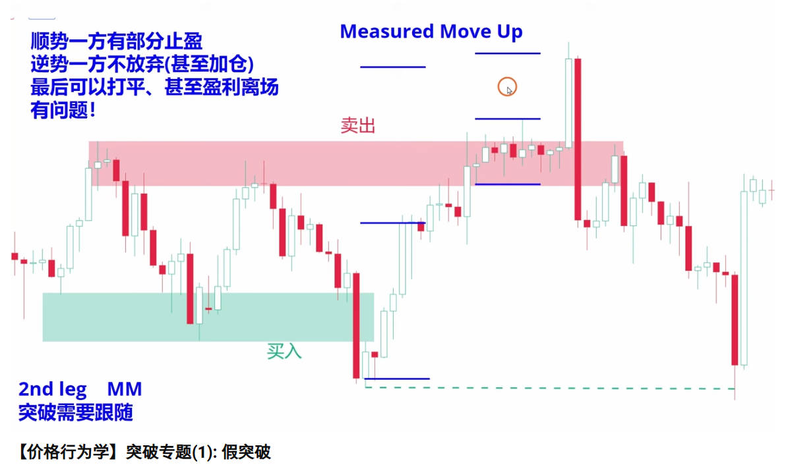
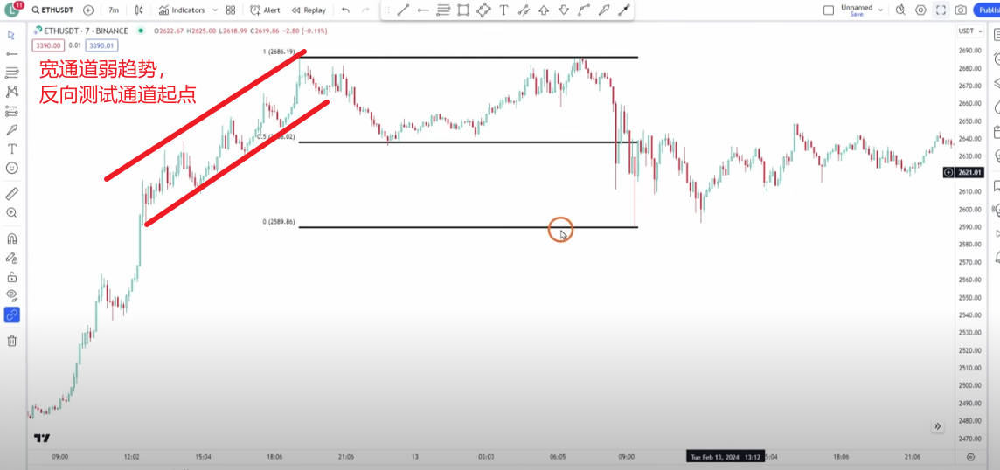
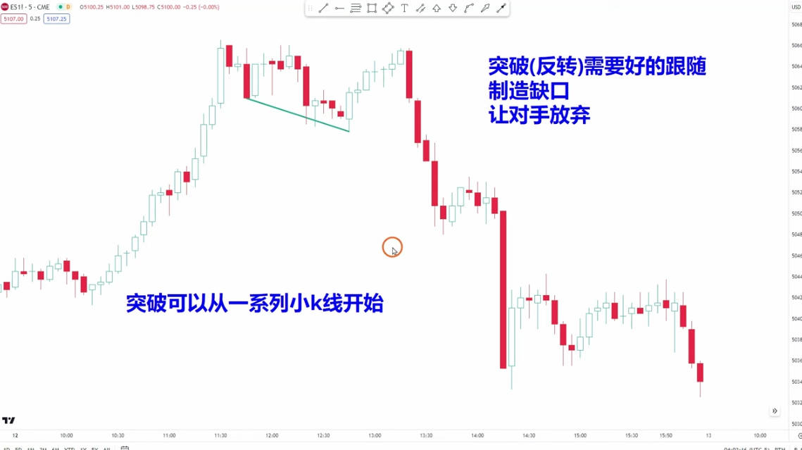
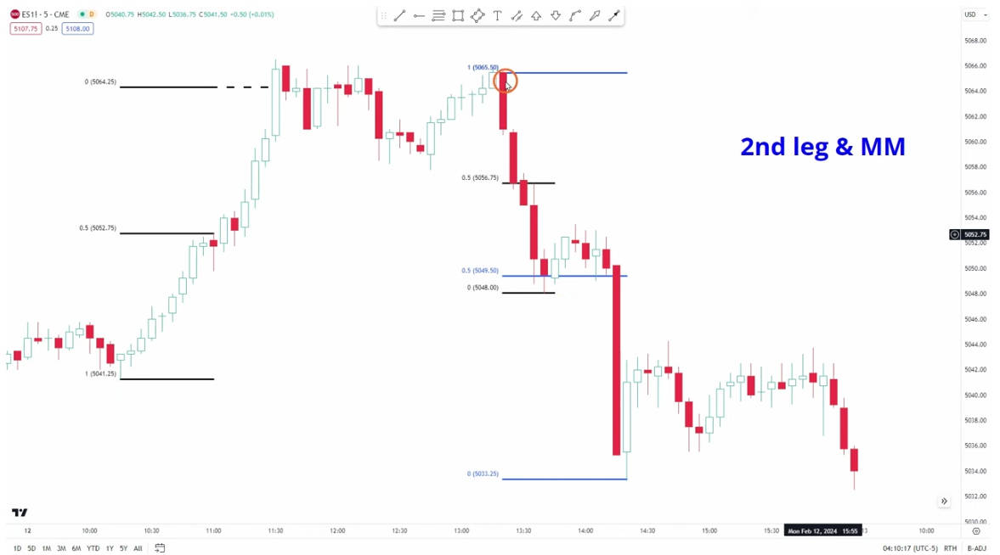

# 突破专题（1）假突破

先判断是趋势交易，还是震荡区间；

80%的突破都是假突破，突破是改变交易的趋势；

<figure><figcaption>
三推楔形，反转
</figcaption></figure>

<figure><figcaption></figcaption></figure>

<figure><figcaption></figcaption></figure>

<figure><figcaption></figcaption></figure>
