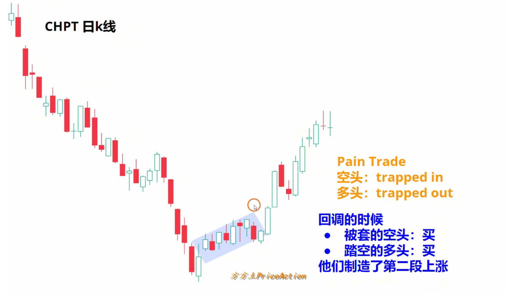
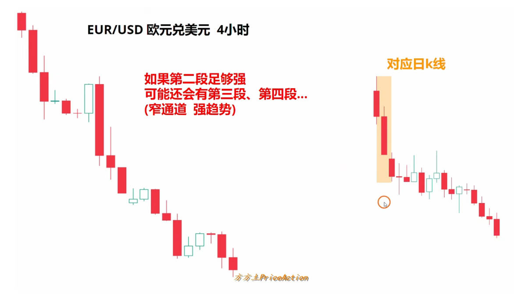

# 突破专题（3）2nd 第二段

1，小概率事件/惊喜K线。2，突破之后大概率会有小的跟随。3，震荡区间的第二段陷阱。

<figure><figcaption></figcaption></figure>

<figure><figcaption></figcaption></figure>

<figure><figcaption></figcaption></figure>

<figure><figcaption></figcaption></figure>

<figure><figcaption></figcaption></figure>

<figure><figcaption></figcaption></figure>

<figure><figcaption></figcaption></figure>

<figure><figcaption></figcaption></figure>
